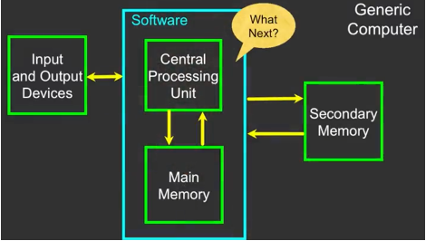

# Programming for Everybody
## Chapter 1
### Hardware Overview


#### Input and Output Devices
-	Input: Mouse, Keyboard, Touchscreen etc.
-	Output: Screen, Speakers, Printer
-	Interaction with Software

#### Central Processing Unit = CPU 
-	Highly sophisticated Curcuit (Chip)
-	With millions of transistors
    - Transistors make yes/no decisions
-	Runs the Program
    - Billions of instructions
        - = set of electrical pulses
        - 3 billion times per second
-	It is always wondering “what to do next?”
-	Not the brains exactly – very dumb but very very fast

#### Main Memory 
-	Fast small temporary storage – lost on reboot – aka RAM
-	File that is created by writing code in Secondary Memory is loaded and translated (in machine language) in Main Memory
-	Program from Main Memory feeds instructions to CPU
-	After Execution by CPU it feeds further instructions etc. -> “fetch-execute-cycle”

#### Secondary Memory/Storage 
-	Slower large permanent storage – lasts until deleted
    - When the Computer turns off, the written program is erased from the Main Memory
    - Secondary Memory is permanent
-	Writing of code and creating of file is being done here 
-	E.g. disk drie, memory stick


## Chapter 6: Strings
### Looking Inside Strings
- We can get any single character in a string using an index specified in square brackets 
    - Using the square brackets is called **"the index operator"**
    - Inside the brackets can stand a constant (integer) or an expression (e.g. substraction etc.)
- The index value must be an integer and starts at zero
- The index value can be an expression that is computed
- e.g. "banana": the letters are numbered, beginning with 0 (-> so the last number should be 5)

`b a n a n a`  
`0 1 2 3 4 5` 

### Reading/Converting Strings

```python
>>> fruit = "banana"
>>> letter = fruit [1]  #this is pronounced "fruit sub one", die Anweisung extrahiert das Zeichen an Indexposition 1
>>> print(letter)
a
>>> x = 3
>>> w = fruit[x-1]      #this is pronounced "fruit sub x - 1"
>>> print(w)
n
```

- You will get a python error if you attempt to index beyond the end of a string (e.g. here: 5) 
- So be careful when constructing index values and slices

#### Strings have length
- The built-in function *len* gives us the length of a string

```python
>>> fruit = "banana"
>>> print(len(fruit))
6
```

### Looping Through Strings
#### Indefinite Loops: 
- Using a while-statement, an iteration variable and the len-function, we can construct a loop to look at each of the letters in a string individually

```python
fruit = "banana"
index = 0                       # iteration variable
while index < len(fruit):
    x = fruit[index]            # first round: index = 0, so x = fruit[0] → x = b, second round: index = 1, so x = fruit[1] → x = a etc.
    print(index, x)
    index = index + 1           # increment index by one each time the loop runs

# 0 b
# 1 a
# 2 n
# 3 a
# 4 n
# 5 a
```

#### Definite Loops:
- Using a for-statement is much more elegant
- The iteration variable is completely taken care of by the for-loop

```python
fruit = "banana"
for letter in fruit: 
    print(letter)

# b
# a
# n
# a
# n
# a
```

#### Looping and Counting Strings
- This is a simple loop that loops through each letter in a string and counts the number of times the loop encounters the "a" character

```python
word = "banana"
sum = 0
for letter in word:
    if letter == "a":
        sum = sum + 1
print(sum)

# 3
```
> Recap: Looking Deeper into *in*
> - The iteration variable (→ here *letter*) "iterates" through the sequence (ordered set, → here *word*)
> - The block (body) of code is executed once for each value in the sequence
> - The iteration variable moves through all of the values in the sequence

### Slicing Strings
- We can also look at any continuous section of a string using a colon operator
- The second number is one beyond the end of the slice - **"up to but not including"**
- If the second number is beyond the end of the string, it stops at the end 

`M o n t y _ P y t h o  n`    
`0 1 2 3 4 5 6 7 8 9 10 11 ` 

```python
>>> s = "Monty Python"
>>> print(s[0:4])           # this is pronounced "s sub 0 colon 4" which means "0 up to 4, but not including 4"!
Mont
>>> print (s[6:7])
P
>>> print(s[6:20])          # this is not a traceback!, it is okay to reference beyond the string
Python
```
- If we leave off the first number or the last number of the slice, it is assumed to be the beginning or the end of the string respectively

```python
>>> s = "Monty Python"
>>> print(s[:2])
Mo
>>> print(s[8:])
thon
>>> print(s[:])
Monty Python
```


----
### Manipulating Strings
----
### String Concatenation (Verkettung)
- When the "+" operator is applied to strings, it means "concatenation"

```python
>>> a = "Hello"
>>> b = a + "There"
>>> print(b)
HelloThere
>>> c = a + " " + "There"
>>> print(c)
Hello There
```

### String operations
**Using *in* as a Logical Operator**
- The *in* keyword can also be used to check to see if one string is "in" another string
- The *in* expression is a logical expression that returns *True* or *False* and can be used in an if-statement

```python
>>> fruit = "banana"
>>> "n" in fruit
True
>>> "m" in fruit
False
>>> "nan" in fruit
True
>>> if "a" in fruit: 
...     print("Found it!")
...     
Found it!
```

### String Comparison

```python
word = input("Give me a word: ")
if word == "banana":
    print("All right, bananas.")
if word < "banana":
    print("Your word," + word + ", comes before banana.")
elif word > "banana":
    print("Your word," + word + ", comes after banana.")
else:
    print("All right, bananas.")
```


> ### String Library
> - Python has a number of string functions which are in the string library
> - These functions are already built into every string - we invoke them by eppending the function to the string variable
> - These functions do not modify the original string, instead they return a new string that has been altered
> - The following functions are from the string library


### Searching a String: the find()-operation
- We use the find()-function to search for a substring within another string
- find() finds the first occurrence of the substring
- If the substring ist noct found, find() returns -1
- Remember that string poisition starts at zero 

`b a n a n a`  
`0 1 2 3 4 5`

```python
>>> fruit = "banana"
>>> pos = fruit.find("na")       # fruit.find() is a method
>>> print(pos)
2                                # the "na" is positioned beginning at position 2
>>> aa = fruit.find("z")
>>> print(aa)
-1
```

### Making Everything UPPER CASE or lower case
- You can make a copy of a string in lower case or upper case
- Often when we are searching for a string using find() we first convert the string to lower case so we cna search a string regardless of case

```python
>>> greet = "Hello Bob"
>>> nnn = greet.upper()
>>> print(nnn)
HELLO BOB
>>> www = greet.lower()
>>> print(www)
hello bob
```

### Searching and Replacing Strings
- The replace() function is like a "search and replace" operation in a word processor
- It replaces all occurrences of the search string with the replacement string

```python
>>> greet = "Hello Bob"
>>> repl = greet.replace("Bob", "Jane")     # the .replace method gives us back a copy 
>>> print(repl)
Hello Jane
>>> repl = greet.replace("o", "X")
>>> print(repl)
HellX BXb
```
### Stripping Whitespace 
- Sometimes we want to take a string and remove whitespace at the beginning and/or end
- lstrip() and rsptrip() remove whitespace at the left or right
- strip() removes both beginning and ending whitespace

```python
>>> greet = "   Hello Bob "
>>> greet.lstrip()
'Hello Bob '
>>> greet.rstrip()
'   Hello Bob'
>>> greet.strip()
'Hello Bob'
```
### Prefixes

```python
>>> line = "Please have a nice day"
>>> line.startswith("Please")
True
>>> line.startswith("p")
False
```

### Example of Combining Different Types of String Manipulation 
Parsing and Extracting

```python
From stephen.marquard@uct.ac.za Sat Jan 5 09:14:16 2008

>>> data = "From stephen.marquard@uct.ac.za Sat Jan 5 09:14:16 2008"
>>> atpos = data.find("@")              # search for the start of something; atpos soll @-position heißen
>>> print(atpos)
21
>>> sppos = data.find(" ", atpos)       # search for the end of something; the second parameter shows where to start the search
>>> print(sppos)                        # sppos soll space-position heißen
31
>>> host = data[atpos+1 : sppos]        # extract the something out
>>> print(host)
uct.ac.za
```


## Chapter 7: Files

### File Processing

> - A text file can be thought of as a sequence of lines
> e.g.  https://www.py4e.com/code/mbox-short.txt 

### Opening a File Using open()
- Before we can read the contents of the file, we must tell Python which file we are going to work with and what we will be doing with the file
- This is done with the open() function (built in function)
- open() returns a "file handle" - a variable used to perform operations on the file
- Similar to "File -> Open" in a Word Processor
- handle = open(filename, mode)
    - returns a handle used to manipulate the file
    - filename is a string
    - mode is optional and should be 'r' if we are planning to read the file and 'w' if we are going to write in the file
        - if we leave this out, it is going to be read

```python
>>> fhand = open('mbox.txt', 'r')
>>> print(fhand)
<_io. TextIOWrapper name= 'mbox.txt ' mode=' r' encoding= 'UTF-8'>      # the handle is giving us information but doesn't give us the file yet
```

#### The newline Character
- We use a special character called the "newline" to indicate when a line ends
- We represent it as \n in strings
- Newline is still one character - not two

```python
>>> stuff = 'Hello\nWorld!'
>>> stuff
'Hello\nWorld!'
>>> print(stuff)
Hello                       
World!
>>> stuff = 'X\nY'
>>> print(stuff)
X
Y
>>> len(stuff)
3                               # so it is a non printing character that moves to the beginning of the next line
```

> - A text file has *newlines* at the end of each line
> - A blank line has a *newline* character as well

#### The File Handle as a Sequence
- A file handle open for read can be treated as a sequence of strings where each line in the file is a string in the sequence
- We can use the *for* statement to iterate through a sequence
- Remember - a sequence is an ordered set

```python
xfile = open('mbox.txt')
for cheese in xfile:            # we put the handle ("xfile") in a for-loop
    print(cheese)               # so the loop will run through every line one after another in the file (to search for 'cheese' in this case)
                                # one round in a loop is for each line in the file
```


### Counting Lines in a File
- Open a file read-only
- Use a for-loop to read each line
- Count the lines and print out the number of lines

```python
fhand = open('mbox.txt')
count = 0
for line in fhand:
    count = count + 1
print('Line Count: ', count)
```

### Reading the *Whole* File
- We can read the whole file (including newlines) into a single string

```python
>>> fhand = open('mbox-short.txt')
>>> inp = fhand.read()
>>> print(len(inp))
94626
>>> print(inp[:20])                 # slicing: starting at the beginning up to indexposition 20
From stephen.marquar
```

### Searching Through a File
- We can put an if-statement in our for-loop to only print lines that meet some criteria

```python
fhand = open('mbox-short.txt')
for line in fhand:
    if line.startswith('From:'):
        print(line)

# From: stephen.marquard@uct.ac.za
#                                    # there are blank lines inbetween the printed results
# From: louis@media.berkeley.edu
#
# From: zqian@umich.edu
#
# From: rilowe@iupui.edu
#

```

> - each line from the file has a *newline* at the end which will be printed 
> - the "print"-statement adds a *newline* to each line
> → we end up with two *newlines* so with an empty line inbetween each printed result

- We can strip the whitespace from the right-hand side of the string using rstrip() from the string library
- The newline is considered "white space" and is stripped

```python
fhand = open('mbox-short.txt')
for line in fhand:
    line = line.rstrip()
    if line.startswith('From:'):
        print(line)

# From: stephen.marquard@uct.ac.za
# From: louis@media.berkeley.edu
# From: zqian@umich.edu
# From: rilowe@iupui.edu

```

### Skipping with Continue
- We can conveniently skip a line by using the *continue* statement

```python
fhand = open('mbox-short.txt')
for line in fhand:
    line = line.rstrip()
    if not line.startswith('From:'):    # this will produce the same outcome as the code before
        continue                        # "skip this line"
    print(line)
```

### Using *in* to Select lines
- We can look for a string anywhere in a line as our selection criteria

```python
fhand = open('mbox-short.txt')
for line in fhand:
    line = line.rstrip()
    if not '@uct.ac.za' in line:
        continue
    print(line)
```

### Prompt for File Name

```python
fname = input('Enter the file name: ')
fhand = open (fname)
count = 0
for line in fhand:
    if line.startswith('Subject:'):
        count = count + 1
print(f'There were {count}, subject lines in {fname})
```

#### Dealing with Bad File names: try-except-statement
```python
fname = input('Enter the file name: ')
try:
    fhand = open(fname)
except:
    print('File cannot be opened:', fname)
    quit()                                  # dont't forget the "quit"!

count = 0
for line in fhand:
    if line.startswith('Subject:'):
        count = count + 1
print(f'There were {count}, subject lines in {fname})
```

## Chapter 8: Lists

### Programming
- Algorithms:
    - A set of rules or steps used to solve a problem
- Data Structures:
    - A particular way of organizing data in a computer
    - e.g. lists, dictonaries, tuples

### What is not a "Collection"?
- Most of our variables have one value in them 
- When we put a new value in the variable, the old value is overwritten

```python
>>> x = 2
>>> x = 4
>>> print(x)
4
```

### A List is a Collection
- A collection allows us to put many values in a single "variable"
- A collection is nice because we can carry many values around in one convenient package

```python
friends = ['Joseph', 'Glenn', 'Sally']
carryon = ['socks', 'shirt', 'perfume']
```

### List Constants
- List constants are surrounded by square brackets and the elements in the list are sepearted by commas
- A list element can be any Python object - even another list
- A list can be empty

```python
>>> print([1, 24, 76])
[1, 24, 76]
>>> print(['red', 'yellow', 'blue'])
['red', 'yellow', 'blue']
>>> print(['red', 24, 98.6])
['red', 24, 98.6]
>>> print([1, [5, 6], 7])           # There are 3 elements in this list!
[1, [5, 6], 7]
>>> print([])
[]
```

### Looking Inside Lists
- Just like strings, we can get at any single element in a list using an index specified in square brackets

```python
| Joseph | Glenn | Sally |
|   0    |   1   |   2   |

>>> friends = ['Joseph', 'Glenn', 'Sally']
>>> print(friends[1])                 # it is pronounced "friends sub 1"
Glenn
```

### Lists Are Mutable
- Strings are "immutable" (unveränderlich) - we cannot change the contents of a string - we must make a new string to make any change
- Lists are "mutable" - we can change an element of a list using the index operator

```python
>>> fruit = "Banana"
>>> fruit[0] = "b"
Traceback
TypeError: 'str' object does not support item assignment
>>> x = fruit.lower()                   # we make a copy of the variable
>>> print(x)
banana
>>> lotto = [2, 13, 26, 41, 63]
>>> print(lotto)
[2, 13, 26, 41, 63]
>>> lotto[2] = 28                       # "lotto sub 2"
>>> print(lotto)
[2, 13, 28, 41, 63]
```

### The Length of Lists
- The len() function takes a list as a parameter and returns the number of elements in the list
- Actually, len() tells us the number of elements in any set or sequence

```python
>>> greet = "Hello Bob"
>>> print(len(greet))
9
>>> x = [1, 2, "joe", 99]
>>> print(len(x))
4
```

### Using the Range-Function
- The range-function returns a list of numbers that range from zero to one less than the parameter
- We an construct an index loop using *for* and an integer interator

```python
>>> print(range(4))
range(0, 4)
>>> print(list(range(4)))
[0, 1, 2, 3]
>>> friends = ['Joseph', 'Glenn', 'Sally']
>>> print(len(friends))
3
>>> print(list(range(len(friends))))
[0, 1, 2] 
```

#### Using the Range-Function in a Loop: the counted loop

```python
friends = ['Joseph', 'Glenn', 'Sally']

for friend in friends:
    print("Happy New Year:", friend)

# ... produces the same output as:

for i in range(len(friends)):               # the iterationvariable i is going through the range [0, 1, 2]
    friend = friends[i]
    print("Happy New Year:", friend)
```

### Concatenating Lists Using **+**
- We can create a new list by adding two existing lists together

```python
>>> a = [1, 2, 3]
>>> b = [4, 5, 6]
>>> c = a + b
>>> print(c)
[1, 2, 3, 4, 5, 6]
>>> print(a)
[1, 2, 3]
```

### Slicing Lists
- Remember: just like in strings, the second number is "up to but not including"

```python
>>> t = [9, 41, 12, 3, 74, 15]
>>> t[1:3]
[41,12]
>>> t[:4]
[9, 41, 12, 3]
>>> t[3:]
[3, 74, 15]
>>> t[:]
[9, 41, 12, 3, 74, 15]
```

### Building a List from Scratch
- We can create an empty list and then add elements using the append method
- The list stays in order and new elements are added at the end of the list
- This shows again, that lists are mutable (veränderbar)

```python
>>> stuff = list()              # this list() is the predefined type, it is empty so far
>>> stuff.append("book")        # we append the word "book" to the list
>>> stuff.append(99)
>>> print(stuff)
["book", 99]
>>> stuff.append("cookie")
>>> print(stuff)
["book", 99, "cookie"]
```

### String operations
**Using *in* as a Logical Operator**
- Python provides two operators that let you check if an item is in a list
- These are logical operators that return *True* and *False*
- They do not modify the list

```python
>>> some = [1, 9, 21, 10, 16]
>>> 9 in some
True
>>>  15 in some
False
>>> 20 not in some
True
```

### Sorting Lists
- A list can hold many items and keeps those items in the order until we do something to change the order
- A list can be sorted (i.e. change its order)
- The sort method (unlike in strings) means "sort yourself"

```python
>>> friends = ['Joseph', 'Glenn', 'Sally']
>>> friends.sort()
>>> print(friends)
["Glenn", "Joseph", "Sally"]       # it is now in alphabetical order 
>>> print(friends[1])
Joseph
```

### Built-in Functions and Lists
- There are a number of functions built into Python that take lists as parameters
- Remember the loops we built? These are much simpler.

```python
>>> nums = [3, 41, 12, 9, 74, 15]
>>> print(len(nums))
6
>>> print(max(nums))
74
>>> print(min(nums))
3
>>> print(sum(nums))
154
>>> print(sum(nums)/len(nums))
25.6
```
#### Calculating the Average
```python
# e.g. calculating the average of numbers (from input) with while-loop, s. Chapter 5: 
total = 0
count = 0
while True:
    inp = input ('Enter a number: ')
    if inp == 'done': break
    value = float(inp)
    total = total + value
    count = count + 1

# now:

numlist = list()                    # we are creating an empty list
while True: 
    inp = input("Enter a nunber: ")
    if inp == "done" : break
    value = float(inp)
    numlist.append(value)           # we append the value to the created list in the variable numlist
average = sum(numlist) / len(numlist)
print("Average:", average)
```

- Both loops have the exact same outcome
- The only difference is:
    - Loop 1 only needs to memorize one number per round
    - Loop 2 needs to memorize all the numbers until it does the calculation
        - This requires memory for every number
        - This is relevant for a very high amount of data

### Connecting Strings and Lists: the Split-Method

```python
>>> abc = "With three words"        # string
>>> stuff = abc.split()             # splits the string and returns a list
>>> print(stuff)                    
["With", "three", "words"]          # here is the list
>>> print(len(stuff))
3
>>> print(stuff[0])
With
>>> for w in stuff:                 # this loop will now print every word 
...   print(w)
...
With
Three
Words
```
- When you do not specify a delimiter (Trennzeichen), multiple spaces are treated like one delimiter
- You can specify what delimiter character to use in the splitting

```python
>>> line = "A lot               of spaces"
>>> etc = line.split()
>>> print(etc)
["A", "lot", "of", "spaces"]
>>> 
>>> line = "first;second;third"
>>> thing = line.split()
>>> print(thing)
["first;second;third"]
>>> print(len(thing))
1
>>> thing = line.split(";")
>>> print(thing)
["first", "second", "third"]
>>> print(leng(thing))
3
```

### Example of Parsing Data 

```python

# e.g. | From | stephen.marquard@uct.ac.za | Sat | Jan | 5 | 09:14:16 | 2008 |
#      |   0  |             1              |   2 |  3  | 4 |     5    |   6  |

fhand = open('mbox-short.txt')
for line in fhand:
    line = line.rstrip()
    if not line.startswith('From '): continue
    words = line.split()
    print(words[2])             # prints second index parameter which is word sub 2 -> Day of the week

>>> From stephen.marquard@uct.ac.za Sat Jan 5 09:14:16 2008
>>> words = line.split()
>>> print(words)
[From", "stephen.marquard@uct.ac.za", "Sat", "Jan", "5", "09:14:16", "2008"]
```

### The Double Split Pattern
- Sometimes we spilt a line one way, and then grab one of the pieces of the line and split that piece again
```python
"From stephen.marquard@uct.ac.za Sat Jan 5 09:14:16 2008"
words = line.split()
email = words[1]                # we pull out word sub 1, which is the email (stephen.marquard@uct.ac.za)
pieces = email.split("@")       # now we have a list of two pieces ["stephen.marquard", "uct.ac.za"]
print(pieces[1])                # the email host is the second piece (pieces sub 1)
```


## Chapter 9: Dictionarys

### A Dictionary is a Collection
> Reminder: List
> - A linear collection of values 
> - Lookup: by position 0, up to the length of -1


- A Dictionary is a linear collection of key-value pairs
- Lookup: by a "tag" or a "key"
- (If you know what the key is, you can look something up really quickly)

### Definition
- Dictionaries are Pythons's most powerful data collection
- Dictionaries allow us to do fast database-like operations in Python
- Similar concepts in different programming languages:
    - Associative Arrays - Perl / PHP
    - Properties or Map or HashMap - Java
    - Property Bag - C# / .Net

- We append values to the end of a List and look them up by position
- We insert values into a Dictionary using a key and retrieve them using a key

```python
>>> cabinet = dict()
>>> cabinet['summer'] = 12
>>> cabinet['fall'] = 3
>>> cabinet['spring'] = 75
>>> print(cabinet)
{'summer': 12, 'fall': 3, 'spring': 75}
>>> print(cabinet['fall'])
3
>>> cabinet['fall'] = cabinet['fall'] + 2
>>> print(cabinet)
{'summer': 12, 'fall': 5, 'spring': 75}
```

### Comparing Lists and Dictionaries
- Dictionaries are like lists except that they use keys instead of numbers to look up values

```python
# List: 
>>> lst = list()
>>> lst.append(21)
>>> lst.append(183)
>>> print(lst)
[21, 183]
>>> lst[0] = 23
>>> print(lst)
[23, 183]

# Dictionary:
>>> ddd = dict()
>>> ddd['age'] = 21
>>> ddd['course'] = 182
>>> print(ddd)
{'age': 21, 'course': 182}
>>> ddd['age'] = 23
>>> print(ddd)
{'age': 23, 'course': 182}
```

### Dictionary Literals (Constants)
- Dictionary literals use curly braces and have a list of "key : value" pairs
- You can make an empty dictionary using empty curly braces

```python
>>> jjj = {'chuck' : 1, 'fred' : 42, 'jan' : 100}
>>> print(jjj)
{'chuck' : 1, 'fred' : 42, 'jan' : 100}
>>> ooo = { }       # same would be: ooo = dict()
>>> print(ooo)
{ }
```

### Dictionary Tracebacks
- It is an error to reference a key which is not in the dictionary
- We can use the *in*-operator to see if a key is in the dictionary

```python
>>> ccc = dict()
>>> print(ccc['csev'])          
Traceback (most recent call last):
    File "<stdin>", line 1, in <module>
KeyError:  'csev'
>>>
# instead:
>>> 'csev' in ccc               # is 'csev' in the dictionary? 
False
```

### Counting/Adding
- Counting names e.g. with e-mail names (from the file mbox-short.txt)
- When we encounter a new name, we need to add a new entry in the dictionary
- If it is the second or later time we have seen the name, we simply add one to the count in the dictionary under that name

```python
counts = dict()
names = ['csev', 'cwen', 'csev', 'zqian', 'cwen']
for name in names: 
    if name not in counts:
        counts[name] = 1
    else: 
        counts[name] = counts[name] + 1
print(counts)
# result: {'csev': 2, 'cwen': 2, 'zqian': 1}
```

### The *get* - Method for Dictionaries
- The pattern of checking to see if a key is already in a dictionary and assuming a default value if the key is not there is so common that there is a *method* called get() that does this for us

```python
# Vergleich: if-statement:
if name in counts:                  # ist 'name' ein Schlüssel im Dictionary 'counts'?
    x = counts[name]                # Wenn ja: x bekommt den Wert von counts[name]
else:                               # Wenn nein: x wird 0
    x = 0

# get-method:
x = counts.get(name, 0)             # Wenn name existiert: gib value of counts[name] zurück
                                    # Wenn nicht: gib den Standardwert 0 zurück

```

### Simplified Counting with *get()*
- we can use get() and provide a default value of zero when the key is not yet in the dictionary- and then just add one

```python
counts = dict()
names = ['csev', 'cwen', 'csev', 'zqian', 'cwen']
for name in names: 
    counts[name] = counts.get(name, 0) + 1
print(counts)
```
> Das heißt "Gib mir den aktuellen Zähler für 'word' – oder 0, wenn es noch nicht existiert – und zähle 1 dazu."


### Example: Counting Pattern
- The general pattern to count the words in a line of text is: 
    - Split the line into words
    - Loop through the words 
    - Use a dictionary to track the count of each word independently

```python
counts = dict()
print('Enter a line of text: ')
line = input('')

words = line.split()

print('Words:', words)

print('Counting...')
for word in words:
    counts[word] = counts.get(word,0) + 1
print('Counts', counts)
```

### Definite Loops and Dictionaries
- Even though dictionaries are not stored in order, we can write a for loop that goes through all the entries in a dictionary
- Actually it goes through all of the keys in the dictionary and looks up the values

```python
>>> counts = ('chuck' : 1, 'fred' : 42, 'jan': 100)
>>> for key in counts:              # it will iterate through the keys
...     print(key, counts[key])     # counts[key]: you can go into the dictionary and pull out the value (it is pronounced "count sub key")
... 
chuck 1
fred 42
jan 100
```

### Retrieving lists of Keys and Values
- You can get a list of keys, values or items (both) from a dictionary

```python
>>> jjj = {'chuck' : 1, 'fred' : 42, 'jan' : 100}
>>> print(list(jjj))                # take whats in this dictionary and return it in the form of a list
['chuck', 'fred', 'jan']            # -> list of the keys
>>> print(list(jjj.keys()))         # call the keys.method 
['chuck', 'fred', 'jan']            # it is the same thing as returning a list (s. above)
>>> print(list(jjj.values()))       # returns a list of the values
[1, 42, 100]
>>> print(list(jjj.items()))        # returns list and values -> list of tuples (s. next chapter)
['chuck' : 1, 'fred' : 42, 'jan' : 100]
```

> #### Bonus: Two Iteration Variables!
> - We loop through the key-value pairs in a dictionary using *two* iteration variables
> - Each iteration, the first variable is the key and the second variable is the corresponding value for the key
```python
jjj = {'chuck' : 1, 'fred' : 42, 'jan' : 100}
for aaa,bbb in jjj.items():         # two iterationvariables: aaa (the key), bbb (the value)
    print(aaa, bbb)
# Result: 
# chuck 1
# fred 42
# jan 100
```

### Example from Chapter 1
```python
name = input('Enter file: ')
handle = open(name)

counts = dict()
for line in handle:
    words = line.split()
    for word in words:
        counts[words] = counts.get(word,0) + 1

bigcount = None
bigword = None
for word,count in counts.items():               # word ist the key, count the value
    if bigcount is None or count > bigcount:    # if the value (count) is greater than the value (bigcount) then: 
        bigword = word                          
        bigcount = count
print(bigword, bigcount)
```

## Chapter 10: Tuples

### Tuples are like Lists
- Tuples are another kind of sequence that functions much liek a list
- They have elements which are indexed starting at 0
- It is like a limited version of lists
    - More efficient but unmodifiable 

```python

>>> x = ('Glenn', 'Sally', 'Joseph')        # lists are in square brackets [], tuples in round brackets ()
>>> print(x[2])
Joseph
>>> y = (1, 9, 2)
>>> print(y)
(1, 9, 2)
>>> print(max(y))
9
>>> for i in y:
...     print(i)
...
1
9
2
```

### Tuples are immutable
- Unlike a list, once you create a tuple, you cannot alter its contents - similar to a string

```python
# List:
>>> x = [9, 8, 7]
>>> x[2] = 6                                                    # lists are mutable
print(x)
[9, 8, 6]

# String:
>>> y = 'ABC'
>>> y[2] = 'D'                                                  # strings are immutable
Traceback: 'str' object does not support item Assignement

# Tuple:
>>> z = (5, 4, 3)
>>> z[2] = 0                                                    # tuples are immutable
Traceback: 'tuple' object does not support item Assignement        
```

### Things *not* to do with Tuples
- Sort (x.sort)
- Add (x.append)
- Reverse the list (x.reverse)
-> anything that wants to change the list

```python
>>> l = list()
>>> dir(l)
['append', 'count', 'extend', 'index', 'insert', 'pop', 'remove', 'reverse', 'sort']    # etc.
>>>
>>> t = tuple()
>>> dir(t)
['count', 'index']
```

### Tuples are more efficient
- Since Python does not have to build tuple structures to be modifiable, they are simpler and more efficient in terms of memory use and performance than lists
- So in our program when we are making "temporary variables" we prefer tuples over lists

### Tuples and Assignments
- We can also put a tuple on the left-hand side of an assignment statement
- we can even omit (auslassen) the parantheses

```python
>>> (x, y) = (4, 'fred')            # it is the same as:
>>> print(y)                        # x = 4
fred                                # y = 'fred'
>>> (a, b) = (99, 98)               # you can't write (a, b) = 9 (so only one value on the right side)
>>> print(a)
99
```

### Tuples and Dictionaries
- The items() method in dictionaries returns a list of (key, value) tuples

```python
>>> d = dict()
>>> d['csev'] = 2
>>> d['cwen'] = 4
>>> for (k,v) in d.items():          # the items() method in dictionaries returns a list of tuples
...     print(k, v)
...
csev 2
cwen 4
>>> tups = d.items()
>>> print(tups)
dict_items([('csev', 2), ('cwen', 4)])
```

### Tuples are comparable
- The comparison operators work with tuples and other sequences
- If the first item is equal, Python goes on to the next element and so on, until it finds elements that differ

```python
>>> (0, 1, 2) < (5, 1, 2)                       # it doesn't look beyond the first value that is True (here 0 and 5)
True
>>> (0, 1, 20000) < (0, 3, 4)                   # ... here 1 and 4
True
>>> ('Jones', 'Sally') < ('Jones', 'Sam')       # ... here Sally and Sam: the 'l' comes before 'm'
True
>>> ('Jones', 'Sally') > ('Adams', 'Sam')       # J > A
True
```

### Sorting Lists of Tuples
- We can take advantage of the ability to sort a list of tuples to get a sorted version of a dictionary
- First we sort the dictionary by the key using the items() method and sorted() function

```python
>>> d = {'a':10, 'c':22, 'b':1}
>>> d.items()
dict_items([('a', 10), ('c', 22), ('b', 1)])
>>> sorted(d.items())
[('a', 10), ('b', 1), ('c', 22))]
```

#### Using sorted()
##### Sort by Key
- We can do this even more directly using the built-in function sorted() that takes a sequence as a parameter and returns a sorted sequence

```python
# So far: 
>>> d = {'b':1, 'c':22, 'a':10}
>>> t = sorted(d.items())
>>> t
[('a':10), ('b':1), ('c':22)]

# Alternative:
>>> for k, v in sorted(d.items()):          # loop through the dictionary in key-order (not value-order!)
...     print(k, v)
...
a 10
b 1
c 22
```

##### Sort by Value
- If we could construct a list of tuples of the form (value, key) we could sort by value
- We do this with a for loop that creates a list of tuples

```python
>>> c = {'a':10, 'b':1, 'c':22}         # this is a dictionary
>>> tmp = list()
>>> for k, v in c.items():
...     tmp.append( (v, k) )
...
>>> print(tmp)
[(10, 'a'), (1, 'b'), (22, 'c')]        # this is a list (of tuples)
>>> tmp = sorted(tmp, reverse=True)     # reverse=True heißt v. hoch nach tief sortieren
>>> print(tmp)
[(22, 'c'), (10, 'a'), (1, 'b')]        # also a list of tuples
```

### Example 
for looking for the 10 most used words (in romeo.txt)

```python
fhand = open('romeo.txt')
counts = dict()
for line in fhand:
    words = line.split()
    for word in words:
        counts[word] = counts.get(word, 0) + 1

# either this: 
lst = list()
for key, val in counts.items():
    newtup = (val, key)
    lst.append(newtup)

lst = sorted(lst, reverse=True)

for val, key in lst[:10]:
    print(key, val)

# Alternative:
print(sorted([(val,key) for key,val in counts.items()], reverse=True))

```
- **List comprehension** creates a dynamic list
- In this case, we make a list of reversed tuples and then sort it
- The line in the square brackets [(v,k) for k,v in c.items()]
    - Is a List
    - We are expressing the list with an expression
    - It is the same as in the for-loop (for key, val in counts.items():)
- The list with the expression will be put in the sorted function
- The result of the sorted function will be printed